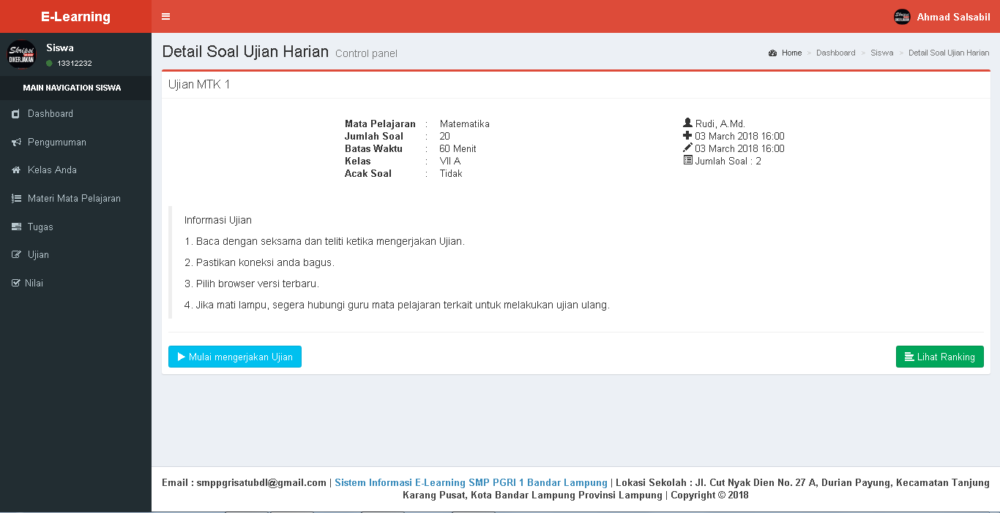
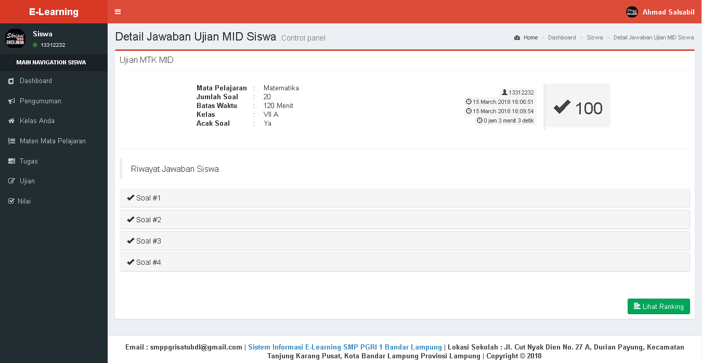

<h2 align="center">Sistem Informasi E-Learning untuk Ujian Online</h2>

## Spesifikasi Project

- Laravel 5.2
- PHP 5.6
- MySQL Database

## Screenshot

1. Dashboard Siswa
   
2. Detail Soal Ujian Siswa
   
3. Ujian Online Siswa
   
4. Hasil Ujian Online Siswa
   
5. Nilai Semua Ujian Online Siswa
   
6. Diskusi Tugas Siswa
   
7. Dashboard Guru
   
8. Data Tugas Siswa
   
9. Tambah Soal Ujian Online
   
10. Detail Soal Ujian Online
    
11. Edit Soal ujian Online
    
12. Dashboard Admin
    
13. Halaman Login
    
